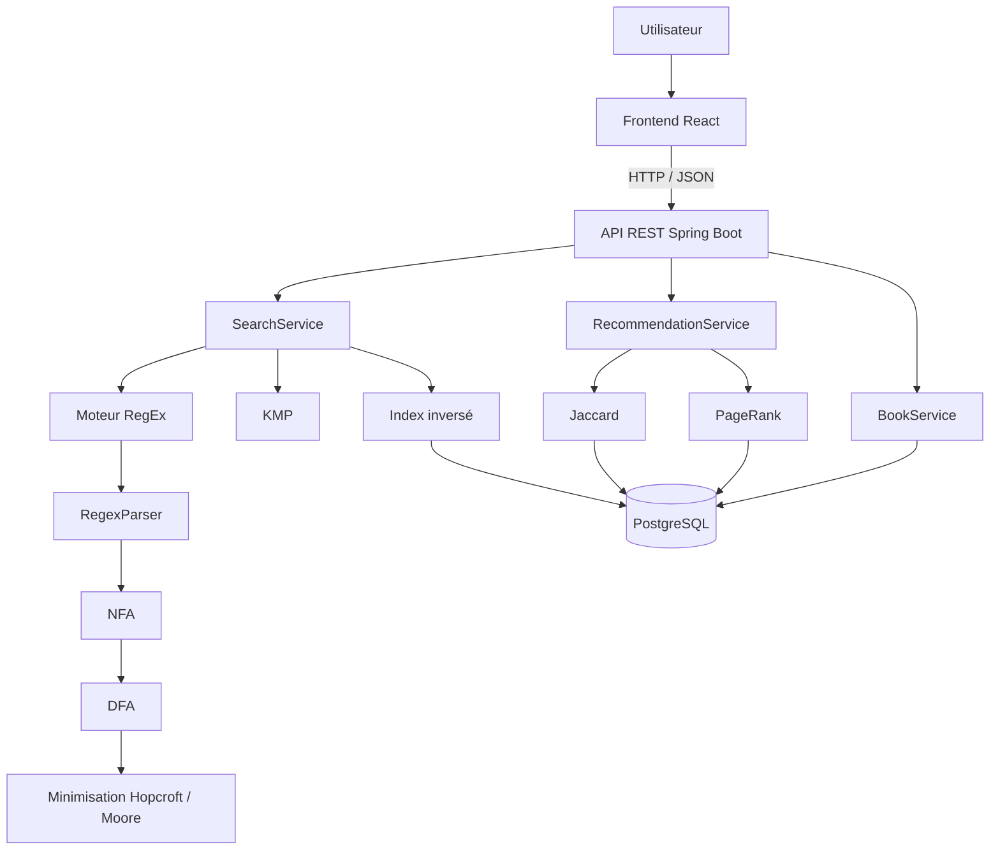

# DAAR — Projet 2 : Moteur de recherche d'une bibliothèque

## 1. Présentation

Ce projet est réalisé dans le cadre de l'UE **DAAR**.

L'objectif est de construire une application web de moteur de recherche permettant d'interroger une bibliothèque de livres textuels.

La bibliothèque finale devra contenir au minimum :

- **1 664 livres** ;
- **10 000 mots minimum par livre**.

L'application doit permettre :

1. une **recherche simple par mot-clé** ;
2. une **recherche avancée par expression régulière (RegEx)** ;
3. un **classement des résultats** selon leur pertinence ;
4. des **suggestions de livres similaires** ;
5. une utilisation depuis plusieurs clients connectés au même serveur.

Le projet réutilise une partie importante du **Projet 1 DAAR**, notamment les algorithmes de recherche textuelle et les automates construits pour les expressions régulières.

---

## 2. Fonctionnement général

Exemple de recherche simple :

```text
Utilisateur
    |
    | "darcy"
    v
Frontend
    |
    | GET /api/search?q=darcy
    v
Backend Spring Boot
    |
    +--> recherche dans l'index
    |
    +--> récupération des livres contenant "darcy"
    |
    +--> calcul du score de pertinence
    |
    +--> classement
    |
    +--> suggestions
    v
Réponse JSON
    |
    v
Frontend
```

Exemple de recherche avancée :

```text
Utilisateur
    |
    | "darc.*"
    v
Frontend
    |
    | GET /api/search/advanced?regex=darc.*
    v
Backend
    |
    +--> RegexParser
    +--> NFA
    +--> DFA
    +--> minimisation
    +--> recherche dans les termes indexés
    +--> récupération des livres correspondants
    +--> ranking
    +--> suggestions
    v
Réponse JSON
```

---

# 3. Architecture cible



Le frontend ne connaît pas les détails des algorithmes.

Il communique uniquement avec le backend grâce à des endpoints REST.

---

# 4. Technologies

## Backend

- Java
- Spring Boot
- Spring Web MVC
- Spring Data JPA
- PostgreSQL
- Maven
- JUnit
- jqwik pour certains tests property-based

## Frontend

- React
- appels HTTP vers l'API REST du backend
- affichage des résultats, détails des livres et suggestions

## Algorithmes

- KMP
- parsing d'expressions régulières
- NFA
- DFA
- minimisation d'automates
  - Hopcroft
  - Moore
- similarité de Jaccard
- PageRank

---

# 5. Structure générale du dépôt

```text
search-engine/
|
+-- backend/
|   |
|   +-- src/main/java/com/sorbonne/
|   |   |
|   |   +-- backend/
|   |   |   +-- BackendApplication.java
|   |   |   +-- config/
|   |   |   +-- health/
|   |   |
|   |   +-- automata/
|   |   +-- regex/
|   |   +-- search/
|   |
|   +-- src/test/java/com/sorbonne/
|   |
|   +-- pom.xml
|   +-- mvnw
|   +-- mvnw.cmd
|
+-- front/
|
+-- README.md
+-- LICENSE
```

À terme, le backend sera complété avec des packages dédiés à :

```text
backend/
|
+-- book/
+-- indexing/
+-- search/
+-- graph/
+-- importation/
+-- config/
```

Les packages :

```text
com.sorbonne.automata
com.sorbonne.regex
com.sorbonne.search
```

proviennent du Projet 1 et constituent le noyau algorithmique réutilisé.

---

# 6. État actuel du backend

## Phase 0 — Initialisation Spring Boot

Statut : **terminée**

La base Spring Boot est opérationnelle.

Travail réalisé :

- configuration PostgreSQL ;
- configuration de Spring Data JPA ;
- suppression de Spring Security, inutile pour le besoin actuel ;
- configuration CORS pour le développement ;
- ajout d'un endpoint de santé ;
- configuration par variables d'environnement.

Endpoint disponible :

```http
GET /api/health
```

Réponse :

```json
{
  "status": "UP"
}
```

---

## Phase 1 — Réutilisation du Projet 1

Statut : **terminée**

Le moteur algorithmique du premier projet a été intégré au backend.

### Packages récupérés

```text
com.sorbonne.automata
com.sorbonne.regex
com.sorbonne.search
```

### Automates

```text
Automaton
State
Status
Transition
```

### RegEx

```text
RegexParser
SyntaxTree
NFA
DFA
DFAM
DFAMHopcroft
DFAMMoore
```

### Recherche

```text
KMPSearch
NativeSearch
PreparedSearch
SearchAlgorithm
SearchCursor
```

Les tests algorithmiques associés ont également été récupérés.

Les anciennes classes liées à l'exécution CLI et aux benchmarks du Projet 1 ne font pas partie du backend métier du Projet 2.

---

# 7. Pourquoi le Projet 1 est réutilisable

Le Projet 1 cherchait principalement des motifs à l'intérieur d'un fichier texte.

Le Projet 2 change l'échelle du problème.

Avant :

```text
motif
  |
  v
fichier
  |
  v
lignes correspondantes
```

Maintenant :

```text
requête
  |
  v
index de la bibliothèque
  |
  v
termes correspondants
  |
  v
livres correspondants
  |
  v
classement
  |
  v
suggestions
```

Les algorithmes du Projet 1 restent donc utiles, mais ils sont désormais utilisés comme une **bibliothèque algorithmique interne au backend**.

---

# 8. Roadmap backend

## Phase 0 — Infrastructure Spring Boot

Statut : **terminée**

Objectif :

```text
Frontend
    |
    v
Spring Boot
    |
    v
PostgreSQL
```

Éléments :

- application Spring Boot ;
- connexion PostgreSQL ;
- configuration CORS ;
- endpoint `/api/health`.

---

## Phase 1 — Intégration des algorithmes

Statut : **terminée**

Objectif :

réutiliser les algorithmes du Projet 1 sans réécrire le moteur RegEx.

Pipeline RegEx :

```text
RegEx
  |
  v
RegexParser
  |
  v
SyntaxTree
  |
  v
NFA
  |
  v
DFA
  |
  v
Hopcroft / Moore
  |
  v
PreparedSearch
```

Pour les motifs littéraux :

```text
mot-clé
  |
  v
KMP
```

---

## Phase 2 — Modèle de données et index inversé

Statut : **à faire**

Cette phase introduira les entités principales.

### Book

Représente un livre.

Exemple :

```text
id            = 42
gutenbergId   = 1342
title         = Pride and Prejudice
author        = Jane Austen
language      = en
wordCount     = ...
contentPath   = ...
```

### Term

Représente un terme unique du dictionnaire.

Exemple :

```text
id    = 817
value = darcy
```

### BookTerm

Association entre un livre et un terme.

Exemple :

```text
bookId       = 42
termId       = 817
occurrences  = 417
```

Cela forme un index inversé :

```text
darcy
 |
 +--> Pride and Prejudice : 417
 +--> Book B              : 73
 +--> Book C              : 11
```

L'objectif est d'éviter de relire les 1 664 fichiers complets à chaque recherche.

---

## Phase 3 — Importation et indexation des livres

Statut : **à faire**

Pipeline cible :

```text
fichier TXT
   |
   v
lecture des métadonnées
   |
   v
tokenisation
   |
   v
normalisation
   |
   v
comptage des termes
   |
   +--> Book
   +--> Term
   +--> BookTerm
```

La bibliothèque finale devra contenir au minimum :

```text
1664 livres
```

avec :

```text
>= 10 000 mots / livre
```

Une petite bibliothèque locale sera utilisée au début pour tester le fonctionnement avant l'import complet.

---

## Phase 4 — Recherche simple

Statut : **à faire**

Endpoint cible :

```http
GET /api/search?q=darcy&page=0&size=20
```

Pipeline :

```text
"darcy"
   |
   v
SearchController
   |
   v
SearchService
   |
   v
index
   |
   v
BookTerm
   |
   v
Books
   |
   v
ranking
   |
   v
JSON
```

Exemple de réponse :

```json
{
  "query": "darcy",
  "mode": "KEYWORD",
  "total": 27,
  "page": 0,
  "size": 20,
  "results": [
    {
      "id": 42,
      "title": "Pride and Prejudice",
      "author": "Jane Austen",
      "occurrences": 417,
      "score": 0.94
    }
  ]
}
```

---

## Phase 5 — Recherche avancée RegEx

Statut : **à faire**

Endpoint cible :

```http
GET /api/search/advanced?regex=darc.*&page=0&size=20
```

Approche prévue :

la RegEx sera appliquée en priorité aux **termes de l'index**, plutôt qu'au contenu complet de tous les livres.

Exemple :

```text
Index
|
+-- darcy
+-- dark
+-- dare
+-- house
+-- love
```

Recherche :

```regex
dar.*
```

Le moteur RegEx peut identifier :

```text
darcy
dark
dare
```

Puis l'index permet de retrouver les livres qui contiennent ces termes.

Cette architecture limite les lectures complètes de fichiers pendant une requête utilisateur.

---

# 9. Classement des résultats

## Phase 6 — Ranking

Statut : **à faire**

Le projet demande de classer les résultats selon leur pertinence.

Le classement pourra combiner plusieurs informations :

```text
nombre d'occurrences
+
centralité du livre dans le graphe
```

La centralité choisie pour l'architecture cible est **PageRank**.

Exemple conceptuel :

```text
score final
   =
score occurrences
   +
score PageRank
```

Les coefficients et la normalisation seront déterminés et évalués expérimentalement.

---

# 10. Graphe de similarité

## Phase 7 — Jaccard

Statut : **à faire**

Chaque livre peut être représenté par l'ensemble de ses termes.

Exemple :

```text
Book A = {love, family, war, house}

Book B = {love, family, house, england}
```

La similarité de Jaccard permettra d'établir des liens entre livres similaires.

Le graphe obtenu aura la forme :

```text
          Book B
         /      \
      0.72      0.61
       /          \
   Book A ------ Book C
          0.54
```

Les scores de similarité seront précalculés lors d'une étape offline afin de ne pas recalculer tout le graphe pendant chaque recherche.

Une structure de stockage cible pourra être :

```text
BOOK_SIMILARITY

book_id
neighbor_id
jaccard_score
```

---

# 11. PageRank

Le PageRank sera calculé sur le graphe de livres.

L'objectif est d'attribuer à chaque livre une mesure de centralité.

Exemple :

```text
Book A -> PageRank 0.0081
Book B -> PageRank 0.0045
Book C -> PageRank 0.0113
```

Cette valeur pourra ensuite participer au classement des résultats.

Une structure cible pourra être :

```text
BOOK_METRIC

book_id
page_rank
```

---

# 12. Suggestions

## Phase 8 — Recommandations

Statut : **à faire**

Après une recherche :

```text
résultats
   |
   v
top 2 ou top 3
   |
   v
voisins dans le graphe de Jaccard
   |
   v
livres similaires
```

Exemple :

```text
Recherche : darcy

Résultats :
1. Pride and Prejudice
2. Emma
3. Sense and Sensibility

Suggestions :
- Persuasion
- Mansfield Park
- Jane Eyre
```

Les livres déjà présents dans les résultats pourront être exclus des suggestions.

---

# 13. Architecture cible de la base de données

```text
BOOK
------------------------
id
gutenberg_id
title
author
language
word_count
content_path
```

```text
TERM
------------------------
id
value
```

```text
BOOK_TERM
------------------------
book_id
term_id
occurrences
```

```text
BOOK_SIMILARITY
------------------------
book_id
neighbor_id
jaccard_score
```

```text
BOOK_METRIC
------------------------
book_id
page_rank
```

Cette structure pourra évoluer pendant l'implémentation.

---

# 14. API REST cible

Le frontend doit rester indépendant de l'implémentation des algorithmes.

Il appellera uniquement l'API.

| Méthode | Endpoint | Description |
|---|---|---|
| GET | `/api/health` | vérifier que le backend est disponible |
| GET | `/api/search?q=...` | recherche simple |
| GET | `/api/search/advanced?regex=...` | recherche RegEx |
| GET | `/api/books/{id}` | détail d'un livre |
| GET | `/api/books/{id}/suggestions` | livres similaires |
| POST | `/api/books/{id}/click` | enregistrer éventuellement un clic utilisateur |

Les routes qui ne sont pas encore implémentées représentent le contrat API cible.

---

# 15. Pagination

Les résultats ne doivent pas être renvoyés intégralement lorsqu'une recherche produit plusieurs centaines de livres.

Exemple :

```http
GET /api/search?q=love&page=0&size=20
```

Réponse :

```json
{
  "query": "love",
  "total": 813,
  "page": 0,
  "size": 20,
  "results": []
}
```

Le frontend pourra ensuite afficher une pagination.

---

# 16. Roadmap frontend

Le frontend peut être développé en parallèle une fois le contrat JSON défini.

## Étape 1 — structure

Créer les vues principales :

```text
Home
SearchResults
BookDetails
```

---

## Étape 2 — recherche simple

Barre de recherche :

```text
[ darcy                         ] [ Search ]
```

Appel :

```javascript
fetch("http://localhost:8080/api/search?q=darcy")
```

---

## Étape 3 — recherche avancée

Interface permettant de saisir une RegEx.

Exemple :

```text
[ darc.*                       ] [ Advanced search ]
```

Appel :

```javascript
fetch(
  "http://localhost:8080/api/search/advanced?regex=darc.*"
)
```

---

## Étape 4 — résultats

Chaque résultat pourra afficher :

```text
Titre
Auteur
Score
Nombre d'occurrences
```

Exemple :

```text
Pride and Prejudice
Jane Austen

417 occurrences
Score : 0.94
```

---

## Étape 5 — détails d'un livre

Appel :

```http
GET /api/books/42
```

La page pourra afficher :

```text
titre
auteur
langue
nombre de mots
métadonnées disponibles
```

---

## Étape 6 — suggestions

Le frontend pourra récupérer ou afficher les suggestions retournées par le backend.

Exemple :

```text
You may also like

- Persuasion
- Mansfield Park
- Jane Eyre
```

---

# 17. Séparation des responsabilités

## Backend

Le backend est responsable de :

```text
PostgreSQL
import des livres
indexation
KMP
moteur RegEx
Jaccard
PageRank
ranking
suggestions
API REST
tests
performances
```

## Frontend

Le frontend est responsable de :

```text
interface utilisateur
navigation
barre de recherche
recherche avancée
affichage des résultats
pagination
page détail
suggestions
connexion aux endpoints REST
```

Le frontend ne doit pas réimplémenter les algorithmes de recherche.

---

# 18. Configuration PostgreSQL locale

Base locale actuelle :

```text
database : idrisdatabase
user     : ai222829
```

Le mot de passe n'est pas enregistré dans le dépôt Git.

Configuration :

```yaml
spring:
  datasource:
    url: ${DB_URL:jdbc:postgresql://localhost:5432/idrisdatabase}
    username: ${DB_USER:ai222829}
    password: ${DB_PASSWORD}
```

La variable `DB_PASSWORD` doit être fournie au lancement.

Exemple :

```bash
DB_PASSWORD='votre_mot_de_passe' mvn spring-boot:run
```

Une autre base pourra être utilisée sans modifier le code :

```bash
DB_URL='jdbc:postgresql://localhost:5432/otherdatabase' \
DB_USER='otheruser' \
DB_PASSWORD='password' \
mvn spring-boot:run
```

---

# 19. Lancer le backend

Depuis :

```bash
cd backend
```

Lancer les tests :

```bash
DB_PASSWORD='votre_mot_de_passe' mvn clean test
```

Puis lancer Spring Boot :

```bash
DB_PASSWORD='votre_mot_de_passe' mvn spring-boot:run
```

Le backend écoute actuellement sur :

```text
http://localhost:8080
```

Test rapide :

```bash
curl http://localhost:8080/api/health
```

Réponse attendue :

```json
{"status":"UP"}
```

---

# 20. Tests

Les tests du Projet 1 associés au noyau algorithmique sont conservés.

Ils couvrent notamment :

```text
Automaton
RegexParser
NFA
DFA
DFAM
Hopcroft
Moore
KMP
NativeSearch
```

Le Projet 2 ajoutera progressivement :

```text
tests repositories
tests d'indexation
tests SearchService
tests API REST
tests Jaccard
tests PageRank
tests de ranking
tests d'intégration PostgreSQL
tests de performance
```

---

# 21. Ordre de développement

L'ordre prévu est :

```text
Phase 0
Spring Boot + PostgreSQL
        |
        v
Phase 1
Algorithmes Projet 1
        |
        v
Phase 2
Book + Term + BookTerm
        |
        v
Phase 3
Import + indexation
        |
        v
Phase 4
Recherche simple + RegEx
        |
        +----------------------+
        |                      |
        v                      v
Frontend                  Phase 5+
connexion API             Jaccard
                               |
                               v
                           PageRank
                               |
                               v
                            Ranking
                               |
                               v
                          Suggestions
```

Le frontend peut donc progresser indépendamment dès que les premiers endpoints de recherche sont stabilisés.

---

# 22. Objectif final

L'architecture finale doit permettre à plusieurs clients d'utiliser simultanément le moteur :

```text
Client 1 ----\
              \
Client 2 ------> Spring Boot ----> PostgreSQL
              /
Client 3 ----/
```

Le backend centralise :

- les livres ;
- l'index ;
- les algorithmes ;
- le classement ;
- les recommandations.

Les clients ne font qu'envoyer des requêtes HTTP et afficher les réponses.

---

## Équipe

Projet réalisé en trinôme dans le cadre du M2 STL — Sorbonne Université.
